# Client Lifecycle

An Undici [Client](Client.md) can be best described as a state machine. The following list is a summary of the various state transitions the `Client` will go through in its lifecycle. This document also contains detailed breakdowns of each state with direct API method, property, and event references.

* A `Client` begins in the **idle** state with no socket connection and no requests in queue.
  * The *connect* event transitions the `Client` to the **pending** state where requests can be queued prior to processing
  * The *close* and *destroy* events transition the `Client` to the **destroyed** state. Since there are no requests in the queue, the *close* event immediately transitions to the **destroyed** state.
* The **pending** state indicates the underlying socket connection has been successfully established and requests are queueing.
  * The *process* event transitions the `Client` to the **processing** state where requests are processed.
  * If requests are queued, the *close* event transitions to the **processing** state; otherwise, it transitions to the **destroyed** state.
  * The *destroy* event transitions to the **destroyed** state.
* The **processing** state initializes to the **processing.running** state.
  * If the current request requires draining, the *needDrain* event transitions the `Client` into the **processing.busy** state which will return to the **processing.running** state with the *drainComplete* event.
  * After all queued requests are completed, the *keepalive* event transitions the `Client` back to the **pending** state. If no requests are queued during the timeout, the **close** event transitions the `Client` to the **destroyed** state.
  * If the *close* event is fired while the `Client` still has queued requests, the `Client` transitions to the **process.closing** state where it will complete all existing requests before firing the *done* event.
  * The *done* event gracefully transitions the `Client` to the **destroyed** state.
  * At any point in time, the *destroy* event will transition the `Client` from the **processing** state to the **destroyed** state, destroying any queued requests.
* The **destroyed** state is a final state and the `Client` is no longer functional.

> The diagram was generated using Mermaid.js Live Editor. Modify the state diagram [here](https://mermaid-js.github.io/mermaid-live-editor/#/edit/eyJjb2RlIjoic3RhdGVEaWFncmFtLXYyXG4gICAgWypdIC0tPiBpZGxlXG4gICAgaWRsZSAtLT4gcGVuZGluZyA6IGNvbm5lY3RcbiAgICBpZGxlIC0tPiBkZXN0cm95ZWQgOiBkZXN0cm95L2Nsb3NlXG4gICAgXG4gICAgcGVuZGluZyAtLT4gaWRsZSA6IHRpbWVvdXRcbiAgICBwZW5kaW5nIC0tPiBkZXN0cm95ZWQgOiBkZXN0cm95XG5cbiAgICBzdGF0ZSBjbG9zZV9mb3JrIDw8Zm9yaz4-XG4gICAgcGVuZGluZyAtLT4gY2xvc2VfZm9yayA6IGNsb3NlXG4gICAgY2xvc2VfZm9yayAtLT4gcHJvY2Vzc2luZyA6IGNsb3NlXG4gICAgY2xvc2VfZm9yayAtLT4gZGVzdHJveWVkIDogZGVzdHJveVxuXG4gICAgcGVuZGluZyAtLT4gcHJvY2Vzc2luZyA6IHByb2Nlc3NcblxuICAgIHByb2Nlc3NpbmcgLS0-IHBlbmRpbmcgOiBrZWVwYWxpdmVcbiAgICBwcm9jZXNzaW5nIC0tPiBkZXN0cm95ZWQgOiBkb25lXG4gICAgcHJvY2Vzc2luZyAtLT4gZGVzdHJveWVkIDogZGVzdHJveVxuXG4gICAgc3RhdGUgcHJvY2Vzc2luZyB7XG4gICAgICAgIHJ1bm5pbmcgLS0-IGJ1c3kgOiBuZWVkRHJhaW5cbiAgICAgICAgYnVzeSAtLT4gcnVubmluZyA6IGRyYWluXG4gICAgICAgIHJ1bm5pbmcgLS0-IFsqXSA6IGtlZXBhbGl2ZVxuICAgICAgICBydW5uaW5nIC0tPiBjbG9zaW5nIDogY2xvc2VcbiAgICAgICAgY2xvc2luZyAtLT4gWypdIDogZG9uZVxuICAgICAgICBbKl0gLS0-IHJ1bm5pbmdcbiAgICB9XG4gICAgIiwibWVybWFpZCI6eyJ0aGVtZSI6ImJhc2UifSwidXBkYXRlRWRpdG9yIjpmYWxzZX0)

<!-- Old description ## Processing state

A `Client` transitions to the **processing** state during the [`Client.dispatch()`](#clientdispatchoptions-handlers) method. The [`Client.connect()`](#clientconnectoptions--callback), [`Client.pipeline()`](#clientpipelineoptions-handler), [`Client.request()`](#clientrequestoptions--callback), [`Client.stream()`](#clientstreamoptions-factory--callback), and [`Client.upgrade()`](#clientupgradeoptions-callback) methods are all based on [`Client.dispatch()`](#clientdispatchoptions-handlers); thus, they all cause a **processing** state transition when called.

Upon entering this state, the `Client` establishes a socket connection and emits the [`'connect'`](Client.md#event-connect) event signalling a connection was successfully established with the `origin` provided during `Client` instantiation.

While in this state, the `Client` is actively processing requests stored in the internal queue. If pipelining is enabled, the `Client` is processing the requests in parallel. Once all of the requests have been processed, the `Client` will remain in this state until the end of the `keepAliveTimeout`. Once the socket connection timeout ends, the `Client` emits a [`'disconnect'`](#event-disconnect) event and returns to the **idle** state. More requests may be queued, and the `Client` will once again transition to the **processing** state. -->
